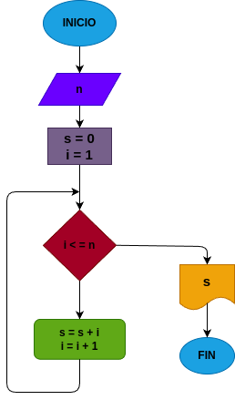

# While_1
Hallar la suma de los n primeros números naturales con el código While.

## input 

### variable de entrada 
n: numero a el cual se le desea aplicar la formula 
### processing 
s: valor inicial de la suma.

i: siguiente dijito a sumar.
mientras i <= n: 

s = s + i

i = i + 1

### output
s
# Diseño

# construccion 

